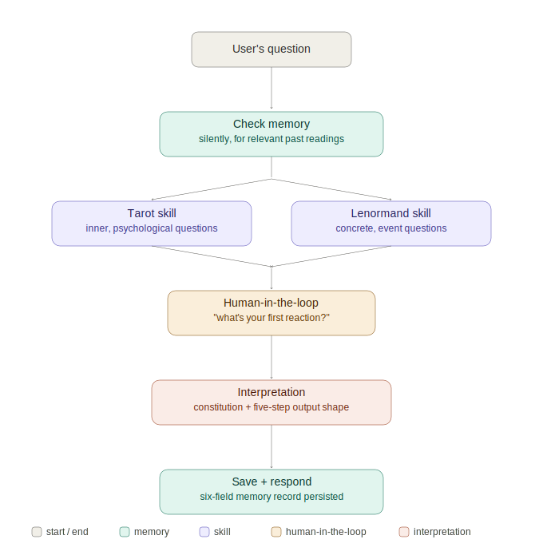

# 🔮 Reflekt — A Reflective Decision Companion

> **This is not a fortune teller.**
> It does not predict the future. It helps you reflect, recognize your own patterns, and take action. Tarot and Lenormand are just *tools* the agent draws on — the product is a reflective decision companion, not a divination app.

> **One-liner / Value Proposition**
> Mainstream tarot apps are amnesiac random-card generators. This is a decision *companion* — an agent with long-term memory that remembers what you drew before, holds your past readings up as a mirror, routes you to the right symbol system for your question (Tarot for inner states, Lenormand for concrete situations), and pushes you toward a concrete next step. It doesn't predict your future. It helps you see yourself and act.

**Track:** Freestyle (or Concierge — fits both; it's a personal, private decision aid)
**Course concepts demonstrated:** (1) Agent Skills (two formal SKILL.md spreads — Tarot and Lenormand), (2) Human-in-the-loop (the "first reaction" step before every interpretation), (3) Tool Use (draw_card, draw_lenormand_card, save_reading, get_recent_readings), (4) Agent reasoning (deciding which symbol system fits the question)
**Model / API:** Gemini 2.5 Flash via Google AI Studio (free tier — no billing required)

> **Why I built this:** I actually use tarot and Lenormand as reflection tools for real decisions. Every app I've tried forgets me, talks at me, and stops at the mystical layer. I wanted a tool *I* would genuinely use — one that remembers, reflects, and lands on action. Winning isn't the point; a complete, well-built project that teaches me the course's agent techniques and that I'll actually open again is.

---

## 1. The Problem

When people face soft, ambiguous life decisions — *should I take this opportunity? what do I do about this relationship? which direction do I go?* — they often reach for tarot or Lenormand. Not because they believe a card predicts the future, but because they need an **external structure that forces them to articulate a fuzzy inner state**.

But existing divination apps fail them in three ways:
- **Amnesiac** — every session is the first time it meets you. No continuity, no growth.
- **One-directional** — it recites generic card meanings at you, ignoring your actual situation.
- **Floating** — it hands you a mystical sentence and stops. No path to action.

The result is a random card-meaning generator. Entertaining for a minute, useless for an actual decision.

## 2. The Solution

A conversational agent that inverts all three failures:

**① It has memory, and it holds up a mirror.**
The agent remembers what you drew for the same issue before, how you interpreted it then, and what actually happened afterward.
> *Example:* Three months ago you drew The Tower for "should I take that gig" and said you were afraid of change. You took it; it went well. Today you draw The Tower again for a similar decision. A normal app re-reads the card meaning. This agent says: *"You drew The Tower in March for a similar choice and said you feared change — but you took it, and it went well. Is this fear the same one, or is something new here?"*
This longitudinal self-comparison is impossible for any stateless app. It requires agent long-term memory — exactly what this course teaches, and the feature I most want for myself.

**② It doesn't fortune-tell; it forces a landing.**
After the reading, the agent walks you toward action: a body-sensation check (light vs. tight), a three-question reflection (my wait-to-respond decision framework), and finally — *"So what's the one small step you're willing to take this week?"* It translates the mystical into a decision.

**③ It's collaborative interpretation, not a one-way verdict.**
After drawing, the agent first asks *"What's your first reaction to this card?"* — because the real value of these systems is your projection, not the card itself. It folds your projection into the reading. This is both more authentic practice AND the course's human-in-the-loop concept. Form and philosophy lock together.

**④ It routes between two symbol systems based on your question.**
Tarot and Lenormand answer different kinds of questions — this is a real, established distinction in practice, not an arbitrary mash-up:
- **Tarot** — inner, psychological, archetypal. 78 image-rich cards. Best for *"what state am I in? what am I afraid of?"* — looking inward, exploring emotion and situation.
- **Lenormand** — concrete, event-driven, literal. 36 cards that combine into sentences. Best for *"how will this unfold? what does he actually mean?"* — looking outward, wanting a specific answer.

The agent reads the nature of your question and guides you to the fitting system. Not "I can do everything" — but "I know which language to speak when." This routing is itself a meaningful demonstration of agent reasoning.

## 2.5 How the reading becomes *yours* — four layers of personalization

The same card means something different for every person, because the card itself is random and public — but four things are unique to each user. The agent weaves all four into every reading:

1. **Situational grounding** — your question is context. The Tower for "should I take this gig" and The Tower for "should I stay in this relationship" are read completely differently. *(prompt-level)*
2. **Projection capture** — after the draw, the agent asks "what's your first reaction to this card?" and follows *your* projection rather than overwriting it. The meaning of tarot was never in the card; it's in what you put on it. *(human-in-the-loop)*
3. **Longitudinal mirroring** — the agent remembers what you drew before, how you read it, and what actually happened, so it can compare across time and surface your patterns. No stateless app can do this. *(long-term memory)*
4. **Interpretive constitution** — the agent doesn't interpret from a neutral fortune-teller stance. It reads through a defined worldview (below), which decides its tone, its values, and which direction it points you. *(system prompt + skills)*

The agent's "accuracy" isn't mystical. It comes from genuinely using your situation, your projection, your history, and a worldview you endorse to understand you.

## 2.6 The Interpretive Constitution — the agent's soul

This is what most separates the agent from a random card-meaning generator. The full charter lives in [`constitution.md`](./constitution.md) and is loaded into the system prompt, so it governs every reading. A few representative principles:

- **The cards are a mirror, not a prophecy** — it never says "X will happen," only "what does this let you see?"
- **Always orient toward agency** — every reading lands on one concrete, controllable next step, via a wait-to-respond framework.
- **See whether this is a finite or infinite game** — for decisions about winning, titles, or face (Carse).
- **See who the investment compounds for** — is this building *your* skills/work/autonomy, or feeding someone else's system?
- **See whether "messy" is scattered or a spiral** — don't misjudge nonlinearity as failure.
- **Admit uncertainty; the user is their own authority** — it offers a mirror, not a verdict.

Encoding a worldview as an agent's behavioral charter — rather than burying generic "be helpful" text in a prompt — is the project's most deliberate design decision. The agent's soul lives in its instruction layer, exactly where an agent's soul belongs.

## 3. Who It's For

People facing soft life decisions who use tarot/Lenormand as a reflection entry point, but who are unsatisfied stopping at the mystical layer — they want to actually get clear and take action. (Honestly: people like me. I'm my own target user, which is exactly why I know what this tool needs to do.)

## 4. Architecture



### Spreads (build order — one complete spread before the next, never three half-done in parallel)

Each spread answers a different *kind* of question, so they play different product roles:

1. **Inquiry spread — Past / Present / Future (Tarot) — MVP, build first.**
   The core "decision companion" loop: a real dilemma → draw → collaborative reading → landing on a next step. This is where the full Interpretive Constitution does its work, so it's built first; the other two spreads are essentially variations of it.

2. **Daily check-in — Thinking / Feeling / Doing (Tarot) — build second; the retention hook.**
   Not for solving a specific decision — a lightweight daily mirror ("what's my head doing, my heart doing, my body doing today?"). Because it's used *daily*, it's where the long-term-memory feature shines brightest: over a week the agent accumulates a continuous state-timeline and can surface patterns ("your Feeling position kept drawing Cups this week but your Doing position stalled — lots of feeling, not much action yet"). Echoes the habit-tracking DNA of an earlier project of mine.

3. **Lenormand Three-Card combination — build third, if time.**
   Proves the architecture holds a second symbol system as a pluggable skill (event-driven questions vs. Tarot's inner-state questions).

**Future work (mention only, NOT built this round):** Tarot Celtic Cross, Lenormand Grand Tableau, Plum Blossom I Ching — the architecture supports more systems as additional skills. Discipline over feature-stuffing.

### How the spreads feed each other
The daily check-in isn't an isolated feature. The state-timeline it builds feeds the inquiry readings: when the user comes with a specific decision, the agent can pull in recent daily data — *"you've logged anxious Feeling cards and stalled Doing cards all week; is this decision tied to that state?"* Daily data makes inquiry readings sharper. This is what turns "the agent has memory" from a slogan into a concrete mechanism: it gets to know you continuously, so it understands you better at the moment you need a decision.

## 5. How It's Built

- **Framework:** Google ADK (Agent Development Kit)
- **IDE:** Google Antigravity (vibe coding)
- **Model:** Gemini 2.5 Flash (free tier, no billing)
- **Skills:** each spread encapsulated as a SKILL.md (progressive disclosure)
- **Memory / data:** card-meaning libraries (tarot + lenormand) + a structured past-reading store. Each reading is saved with these fields: **Question · Interpretation · Action · Emotion · Date · Outcome** (Outcome filled in later, on revisit). Structured storage is what makes the "mirror" possible — and what *(future work)* a Pattern Detector could later read to surface repeating patterns automatically.
- **Routing:** the agent decides which symbol system fits the user's question (inner/psychological → Tarot, concrete/event → Lenormand), and may briefly ask the user if the question is genuinely ambiguous. Implemented as instruction-level reasoning; a more formal Planner/Router component is a natural future extension.

### Every reading follows a fixed output shape
To keep the agent's responses consistent and aligned with the constitution, each reading is generated in five steps:

**Reflection → Pattern → Possible Meaning → Action → Journal Prompt**

- *Reflection* — mirror the user's situation and their first reaction back to them
- *Pattern* — surface anything relevant from past readings (on a first-ever session, this step gracefully notes there's no history yet)
- *Possible Meaning* — the interpretation, held as a possibility not a verdict
- *Action* — one concrete, controllable next step (the mandatory landing)
- *Journal Prompt* — a question to carry away and sit with

### Built this round vs. future work
- **This round (MVP — built and verified working):** Reflective-companion positioning, Tarot Three-Card inquiry spread (`tarot-three-card-spread` skill), Lenormand three-card combination spread (`lenormand-three-card` skill), question-type routing between the two, human-in-the-loop (first reaction), structured memory (six fields, persisted across sessions), full 10-principle constitution wired into the system prompt, fixed five-step output shape, graceful error handling (e.g. free-tier rate limits), and a working chat web UI via `adk web`.
- **Future work (named in writeup, not built):** a formal Planner/Router component, automatic Pattern Detector, long-term revisit loop ("want to come back next week to review?"), daily Thinking/Feeling/Doing check-in spread, Tarot Celtic Cross, card-face images in a custom frontend, additional symbol systems (e.g. Plum Blossom I Ching).
- **Human-in-the-loop:** clarifying question before reading + projection question after draw

## 6. Setup Instructions

### Requirements
- Python 3.10+
- A free Gemini API key from [Google AI Studio](https://aistudio.google.com/apikey) (no billing required)

### Project structure
```
tarot_agent/
  ├── .env                  # your API key (never committed — see below)
  ├── .gitignore             # excludes .env from version control
  ├── agent.py               # defines the agent, loads skills, exposes `root_agent`
  ├── tools.py                # draw_card (Tarot) and draw_lenormand_card (Lenormand)
  ├── memory.py                # structured six-field memory store (readings.json)
  └── skills/
      ├── tarot-three-card-spread/
      │   └── SKILL.md          # Past/Present/Future spread mechanics
      └── lenormand-three-card/
          └── SKILL.md           # Lenormand combination-reading mechanics
```

> ⚠️ **Note on folder naming:** the project's root folder name must be a valid
> Python identifier (letters, digits, underscores only — e.g. `tarot_agent`,
> not `Tarot Agent`). ADK's agent auto-discovery derives a Python module name
> from the folder name, so spaces or hyphens will cause a `ValueError` when
> running `adk web`.

### 1. Clone the repo and install dependencies
```bash
git clone <your-repo-url>
cd tarot_agent
pip install google-adk python-dotenv
```

### 2. Set up your API key
Create a file named `.env` in the project root:
```
GEMINI_API_KEY=your_key_here
```
This file is excluded from version control via `.gitignore` — never commit
your key. `agent.py` reads it automatically and maps it to the environment
variable ADK expects (`GOOGLE_API_KEY`).

### 3. Run the agent — two ways

**Option A — Web chat UI (recommended):** ADK ships a built-in developer
web UI that auto-discovers any folder containing a `root_agent` variable in
`agent.py`. No frontend code required.
```bash
adk web .
# if the `adk` command isn't on your PATH, use:
python -m google.adk.cli web .
```
Then open the printed local URL (typically [http://127.0.0.1:8080](http://127.0.0.1:8080)) in your
browser. The UI also exposes an **Events/Traces** panel, useful for
inspecting exactly which tools and skills the agent invoked on each turn.

**Option B — Terminal chat loop:**
```bash
python agent.py
```
A simple text-based conversation loop, useful for quick local testing
without a browser.

> ⚠️ **API key handling:** The Gemini API key is read from an environment
> variable / `.env` file, which is excluded via `.gitignore`. No keys are
> committed to this public repo.

### Free-tier note
`gemini-2.5-flash`'s free tier has a modest daily request quota. If you hit
a `429 RESOURCE_EXHAUSTED` error while testing heavily, the agent will show
a friendly message rather than crashing — just wait for the quota to reset,
or use a fresh API key from a new Google Cloud project.

## 7. Acknowledgements

- All agent core logic, architecture design, and tool integration in this repository are original.
